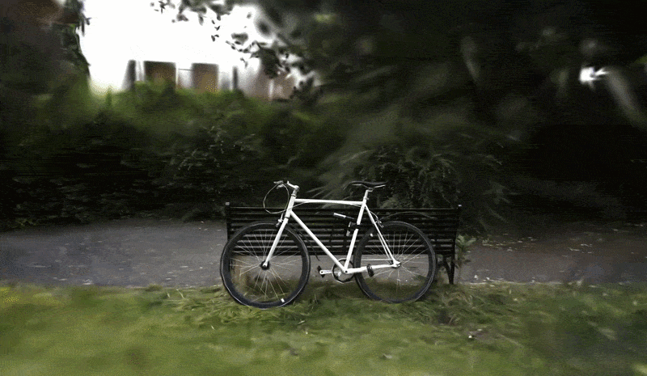

<div align="center">

<pre>
   ░██    ░██                          ░██████         ░██                       
   ░██                                ░██   ░██        ░██                       
░████████ ░██░████████  ░██    ░██          ░██  ░████████  ░████████  ░███████  
   ░██    ░██░██    ░██ ░██    ░██      ░█████  ░██    ░██ ░██    ░██ ░██        
   ░██    ░██░██    ░██ ░██    ░██          ░██ ░██    ░██ ░██    ░██  ░███████  
   ░██    ░██░██    ░██ ░██   ░███    ░██   ░██ ░██   ░███ ░██   ░███        ░██ 
    ░████ ░██░██    ░██  ░█████░██     ░██████   ░█████░██  ░█████░██  ░███████  
                               ░██                                ░██            
                         ░███████                           ░███████             
</pre>

</div>

# tiny3dgs

A pure PyTorch implementation of [3D Gaussian Splatting](https://arxiv.org/abs/2308.04079) that needs no custom CUDA kernels.

3D Gaussian Splatting reconstructs a 3D scene from a set of photos as a cloud of anisotropic Gaussians, then renders novel views by rasterizing that cloud in real time. This repo implements the full training pipeline in plain PyTorch autograd: point cloud initialization, a differentiable rasterizer, adaptive density control, and per parameter optimization. It is built to be readable and hackable rather than to match the speed of the reference CUDA implementation.

<p align="center">
  
</p>

## Features

- **Fully differentiable renderer**, based on tiles, with frustum and tile culling, so cost scales with what is actually visible instead of every gaussian against every pixel
- **Real dataset support**: loads camera poses and the initial point cloud from a [COLMAP](https://colmap.github.io/) reconstruction or a [nerfstudio](https://docs.nerf.studio/) `transforms.json`
- **Adaptive density control (optional)**: clones or splits Gaussians in regions that are not reconstructed well enough, and prunes Gaussians that are oversized or have collapsed to near zero opacity
- **Learning rates set per parameter**, with decay on the position learning rate, matching the reference 3DGS defaults
- **Color that depends on viewing direction**, using degree 3 spherical harmonics
- **Standard PLY export**: output opens directly in common Gaussian Splatting viewers

## Installation

```bash
git clone https://github.com/ric0fede/tiny3dgs.git
cd tiny3dgs
pip install -r requirements.txt
```

## Preparing a dataset

**COLMAP.** Run COLMAP on your photos, then run `image_undistorter` so both the images and the intrinsics become plain PINHOLE (this codebase assumes an undistorted camera). Expected layout:

```
my_scene/
  images/            undistorted photos
  sparse/0/          cameras.bin, images.bin, points3D.bin
```

**nerfstudio.** Any dataset with a `transforms.json` (for example `ns-process-data` output) works directly. A COLMAP point cloud alongside it will be used for initialization if present, otherwise the point cloud is seeded randomly (lower quality).

## Quickstart

```bash
python train.py my_scene/ --iters 8000 --res-scale 0.25
```

or, with logging to a timestamped file under `logs/`:

```bash
./train.sh my_scene/ --iters 8000 --res-scale 0.25
```

This writes `model.ply` and `comparison.png` into `my_scene/` (or wherever `--outdir` points). `comparison.png` shows a held out view next to the model's prediction. A large gap between held out and training error means the model memorized the training views instead of learning the scene.

Run `python train.py --help` for the full list of options (learning rates, densification and pruning schedule, resolution, batch size, and so on).

## Using it as a library

```python
from tiny3dgs.reconstruct import reconstruct

model, history = reconstruct("my_scene/", iters=3000, res_scale=0.25)
```

`reconstruct()` returns the trained `GaussianModel` and the per iteration loss history.

## Project structure

| File | What it does |
|---|---|
| `tiny3dgs/camera.py` | Pinhole camera model (position, rotation, intrinsics) |
| `tiny3dgs/sh.py` | Spherical harmonics evaluation for color that depends on viewing direction |
| `tiny3dgs/gaussians.py` | `GaussianModel`, the learnable Gaussian cloud |
| `tiny3dgs/colmap.py` | COLMAP reconstruction reader (poses and point cloud) |
| `tiny3dgs/nerfstudio.py` | nerfstudio `transforms.json` reader |
| `tiny3dgs/tiled.py` | Rasterizer based on tiles, differentiable |
| `tiny3dgs/optim.py` | Learning rates per parameter, plus position LR decay |
| `tiny3dgs/densify.py` | Adaptive density control: clone and split |
| `tiny3dgs/density.py` | Adaptive density control: pruning |
| `tiny3dgs/ply.py` | PLY export and import |
| `tiny3dgs/reconstruct.py` | Main training pipeline |
| `train.py` | Command line entry point |
| `train.sh` | Shell wrapper with logging |

## How it works

1. **Initialization.** Each point in the SfM point cloud becomes a Gaussian: position from the point, color from its RGB, initial scale from the distance to its nearest neighbors.
2. **Rendering.** Each Gaussian's 3D covariance is projected to a 2D covariance in screen space (EWA splatting), Gaussians are sorted by depth, and colors are alpha composited front to back per pixel. All of it is differentiable end to end.
3. **Optimization.** A photometric L1 loss against the training photos is backpropagated into position, rotation, scale, opacity, and SH color.
4. **Adaptive density control (optional).** Periodically, Gaussians with a high gradient in screen space are cloned (if small) or split (if large) to add detail where the model is struggling. Oversized or nearly transparent Gaussians are pruned.
5. **Export.** The final cloud is written to a standard PLY layout.

## Limitations

- The pure PyTorch rasterizer is much slower than the reference CUDA kernel. It has similar tile culling behavior, but no true kernel fusion.
- No pruning by screen space radius (would need per view bookkeeping this codebase does not track).
- *Built for learning and hacking, not for large scenes out of the box*.

## References

- Kerbl, B., Kopanas, G., Leimkühler, T., & Drettakis, G. (2023). [3D Gaussian Splatting for Real-Time Radiance Field Rendering](https://arxiv.org/abs/2308.04079). *ACM Transactions on Graphics*, 42(4).
- Schönberger, J. L., & Frahm, J. M. (2016). Structure-from-Motion Revisited. *CVPR*.
- Tancik, M., et al. (2023). Nerfstudio: A Modular Framework for Neural Radiance Field Development. *SIGGRAPH*.
